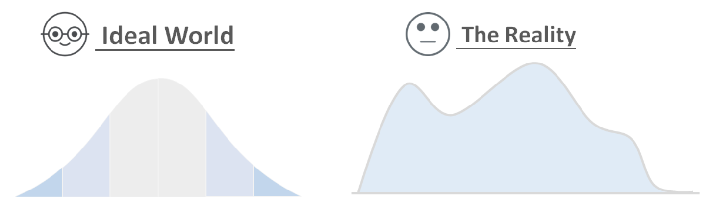
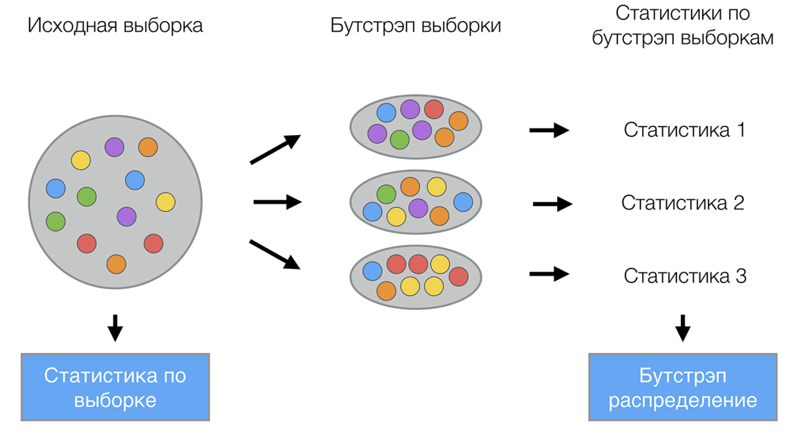
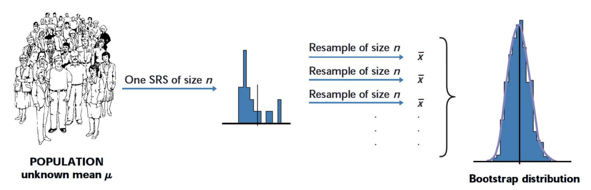

```{r setup, include=FALSE}
knitr::opts_chunk$set(echo = TRUE)
```

<center>
{width=500px}
</center>

## Что такое бутстрап? 

__Бутстрап__ - это метод оценки статистик сложных распределений. Часто возникает необходимость проверить гипотезу о какой-то очень неудобной статистике, распределение которой неизвестно или построить для неё доверительный интервал. 

Чтобы сделать это, надо придумать как распределение этой статистики получить. Мы с вами уже знаем два способа сделать это. 

Способ номер один называется параметрическим. Мы предполагаем, что генеральная совокупность имеет какое-то распределение. Мы можем даже проверить гипотезу об этом с помощью какого-нибудь критерия. После мы на основе этого распределения можем придумать адекватную случайную величину для проверки гипотезы. Именно так мы поступали раньше. Иногда такую случайную величину придумать сложно или вовсе невозможно. Например, поди придумай адекватный критерий для медианы или моды. К тому же не очень понятно из каких соображений выбирать семейство распределений для проверки гипотезы, так как про данные ничего неизвестно. Другим способом был тест отношения правдоподобий. Пришло время познакомиться с третьим методом.

Он говорит следующее: давайте извлечём из генеральной совокупности какое-то количество выборок, посчитаем по ним нашу статистику, для которой доверительный интервалы мы хотим получить, а потом оценим эмпирически её выборочное распределение и на его основе получим доверительные интервалы. Этот способ применим скорее в теории, чем на практике. Если мы можем генерировать бесконечное число выборок из генеральной совокупности, то для нас незатруднительно посчитать истинное значение интересующих нас параметров.  

Эти мысли подводят нас к идее бутстрапа. В нашем распоряжении есть выборка. Давайте сделаем вид, что она и есть генеральная совокупность и будем извлекать из неё с повторением элементы. На основе получившихся подвыборок мы можем оценить всё, что нашей душе угодно. Поначалу такое кажется безумием, но это реально работает. И есть даже несколько теорем, которые доказывают почему это работает и как нужно правильно делать это в сложных ситуациях. 

Опишем бутстрап чуть более формально. Пусть имеется выборка $X$ размера $N$. Равномерно возьмём из выборки $N$ объектов с возвращением. Это означает, что мы будем $N$ раз выбирать произвольный объект выборки (считаем, что каждый объект достаётся с одинаковой вероятность $\frac{1}{N}$), причём каждый раз мы выбираем из всех исходных $N$ объектов. Можно представить себе мешок, из которого достают шарики: выбранный на каком-то шаге шарик возвращается обратно в мешок, и следующий выбор опять делается равновероятно из того же числа шариков. Конечно же из-за возвращения среди них окажутся повторы. 

Обозначим новую выборку через $X_1$. Повторяя процедуру $B$ раз, сгенерируем $B$ подвыборок $X_1, \ldots, X_B$. Теперь мы имеем достаточно большое число выборок и можем оценивать различные статистики исходного распределения.

<center>
{width=400px}
</center>

<center>
{width=400px}
</center>

## Разбираемся на примере

у нас есть данные по времени ремонта телекоммуникационного оборудования региональной в западной части США компании Verizon. Компания оказывает услуги своим клиентам и клиентам других компаний. При этом если компания дольше оказывает услуги по ремонту для клиентов других компаний, чем для своих, то ее могут оштрафовать на круглую сумму. Давайте проверим гипотезу о том, что время на ремонт для своих клиентов существенно ниже чем время на ремонт других компаний. 

Подгрузим данные

```{r}
library(dplyr)
library(ggplot2)
library(tidyr)
library(readr)

df <- read.csv('data/verizon.csv', sep='\t')
head(df)
```

Теперь посмотрим на наши данные. Во-первых, видим сильный перекос в наблюдениях: 

```{r}
df %>% 
  group_by(Group) %>% 
  summarise(count_n = n(), 
            mean_time = mean(Time), 
            median_time = median(Time))
```

Во-вторых, в выборке есть выбросы. Это можно увидеть по длинному хвосту распределения:

```{r}
qplot(df$Time, bins=20)
```

Из-за этих двух причин средние будут не очень адекватной оценкой для типичного представителя выборки. Используя их, мы будем искуственно находиться на стороне компании. Поэтому гораздо уместнее сформулировать в терминах медиан, так как они нечувствительны к выбросам в отличие от средних. 

$$
\begin{aligned}
&H_0: \hspace{2mm} med_1 = med_2 \\
&H_1: \hspace{2mm} med_1 > med_2
\end{aligned}
$$

Беда в том, что для медиан как раз у нас нет хорошей статистики. Это весомый повод прибегнуть к бустрапу!

Закодим бустрап в виде двух функций. Первая будет делать `B` выборок.

```{r}
get_bootstrap_samples <- function(df, B){
    
    N = nrow(df)      # размер каждой выборки
    sample = c()      # сюда буду записывать медианы
    
    for(i in 1:B){
        # генерируем выборки
        df_boot = df %>% sample_n(size = N, replace=TRUE)
        # записываем в массив
        sample = append(sample, median(df_boot$Time))
    }
    return(sample)
}

# одна выборка из трёх сбутстрапированных медиан
get_bootstrap_samples(df, 3)
```

Вторая функция будет искать квантили сгерированого распределения. 

```{r}
stat_intervals <- function(stat, alpha){
    otv <- quantile(stat, c(alpha/2, (1 - alpha/2)), name = FALSE)
    return(otv)
    }
```

Отделим данные по внутренним и внешним клиентам друг от друга и построим доверительные интервалы для каждой из медиан. Будем бустрапировать $10000$ выборок. 

```{r}
ilec = df %>% filter(Group == 'ILEC')
clec = df %>% filter(Group == 'CLEC')

clec_median_scores = get_bootstrap_samples(clec, 10000)
ilec_median_scores = get_bootstrap_samples(ilec, 10000)
```

```{r}
qplot(clec_median_scores,bins = 30)
```

```{r}
qplot(ilec_median_scores, bins = 30)
```

Смотрим на итоговые доверительный интервалы 

```{r}
cat("95% доверительный интервал для медианной времени работы со своими компаниями:", stat_intervals(ilec_median_scores, 0.05),'\n')
cat("95% доверительный интервал для медианной времени работы с чужими компаниями:", stat_intervals(clec_median_scores, 0.05))
```

По аналогии найдём доверительный интервал для разности медиан. 

```{r}
delta_median_scores = clec_median_scores - ilec_median_scores
cat("95% доверительный интервал для разности медиан:", stat_intervals(delta_median_scores, 0.05))
```

> **Вывод:** 0 в интервал не входит, поэтому кажется, что для чужих компаний время работы дольше