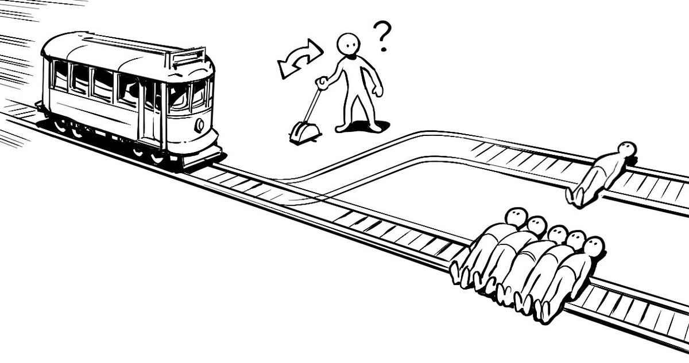

```{r setup, include=FALSE}
knitr::opts_chunk$set(echo = TRUE)
```

## 1. Бонд. Джеймс Бонд

<center>
{width=300px}
</center>

Джеймс Бонд утверждает, что он предпочитает пить мартини взболтанным, но не смешанным. Чтобы проверить это на практике, можно предложить ему пройти так называемый blind test, или слепое тестирование. Можно было бы завязать ему глаза, несколько раз предложить на выбор взболтанный и смешанный мартини, а после этого спросить какой напиток он предпочитает В данном случае если бы Джеймс Бонд выбрал взболтанный напиток, это считалось бы успехом, потому что его выбор соответствовал бы его утверждению. В противном случае считалось бы, что произошла неудача.

### Шаг №1: Формулируем гипотезу

$$
\begin{aligned}
H_0: & \quad \text{Джеймс бонд не различает напитки} \\
H_1: & \quad \text{Бонд различает напитки}
\end{aligned}
$$ 

<br/>

Выбока: $X_1, \ldots, X_n$. Если Бонд не различает два напитка, он берёт их наугад. Сформулируем это в терминах $X \sim Bern(p)$.

$$
\begin{aligned}
H_0: & \quad p = 0.5 \\
H_1: & \quad p \ne 0.5
\end{aligned}
$$ 

**Важно:**

Эксперимент с завязанными глазами нужно провести $n$ раз. В итоге у нас в руках окажется выборка, по которой мы сможем найти $\hat p$. Предположим, что на основе 10 испытаний мы получили, что $\hat p = \frac{6}{10}$. Означает ли это, что Бонд отвечает за свои слова?  Возникает соблазн сказать, что да, так как число получилось больше $\frac{1}{2}$, и это ошибочный соблазн. Давайте вспомним немаловажный факт: наша оценка $\hat p$ это функция от выборки. При других наблюдениях мы могли бы получить другую оценку. Хочется понять насколько сильно эта оценка отличается от нашей.

### Шаг №2: Пытаемся проверить гипотезу с помощью доверительного интервала 

__Секундочку...__ Мы же уже умеем отвечать на этот вопрос. За точность оценки отвечает доверительный интервал. Мы помним, что 

Если $X \sim Bern(p)$, то:

$$
\begin{aligned}
&E(X) = p \\
&Var(X) = p \cdot (1-p)
\end{aligned}
$$ 

А следовательно по ЦПТ: 

$$\hat p = \bar x  \overset{asy}{\sim} N \left(p, \frac{p(1-p)}{n} \right)$$

$$
\frac{\hat p - p}{\sqrt{\frac{p (1 - p)}{n}}} \overset{asy}{\sim} N (0,1)
$$

И следовательно можем вывести формулу для доверительного интервала, как мы делали это до этого: 

$$
P\left(\hat{p} - 1.96 \cdot \sqrt{\frac{\hat{p} \cdot (1 - \hat{p})}{n}} \le p \le \hat{p} + 1.96 \cdot \sqrt{\frac{\hat{p} \cdot (1 - \hat{p})}{n}} \right) = 0.95
$$

```{r}
p_hat = 0.6
n = 10

sd_p = sqrt(p_hat*(1-p_hat)/n)
p_left  = p_hat - qnorm(1-0.05/2)*sd_p
p_right = p_hat + qnorm(1-0.05/2)*sd_p
cat('Параметр p с вероятностью 95% лежит между',p_left, 'и', p_right, '\n')
cat('Ширина интервала:', p_right - p_left)
```

Диапазон доверительного интервала вышел довольно широким. Более того, в него попадает  0.5 . Получается, что Джеймс вполне может врать. Попробуем проверить гипотезу теперь без доверительного интервала:

### Шаг №3 Проверяем гипотезу

Опять же, знаем, что: 

$$
\frac{\hat p - p}{\sqrt{\frac{p (1 - p)}{n}}} \overset{asy}{\sim} N (0,1)
$$

При $H_0$ у нас $p = 0.5$. Следовательно, можем ее подставить в уравнение и посчитать эту формулу. А потом получившиеся значение сравнить с критическим. 

$$
\frac{\hat p - 0.5}{\sqrt{\frac{0.5(1-0.5)}{10}}} \overset{asy}{\sim} N (0,1).
$$

```{r}
p_h0 = 0.5
p_hat = 0.6
n = 10

stat = (p_hat - p_h0) / sqrt((p_h0 * (1 - p_h0)) / 10)

# уровень значимости alpha
alpha = 1 - 0.95    

# левая и правая критические точки
z_left = qnorm(alpha/2)
z_right = qnorm(0.95 + alpha/2)

if ((stat > z_left) && (stat < z_right)){
    print('Гипотеза не отверглась')
} else {
    print('Гипотеза отверглась')
}
```

## 2. О мышах и людях 

<center>
{width=400px}
</center>

Для изучения аспектов процесса принятия моральных решений психологи уже много лет используют этические дилеммы, с помощью которых оценивают действия людей в гипотетических ситуациях. Один из самых известных примеров — это [проблема вагонетки,](https://ru.wikipedia.org/wiki/Проблема_вагонетки) в которой необходимо принять решение о том, стоит ли пожертвовать одним человеком для спасения пятерых.

Бельгийские психологи воплотили дилемму в реальную жизнь. Участники эксперимента должны были выбрать, ударить током пять мышей или одну мышь. Эксперимент проходил следующим образом. Участника сажали перед двумя клетками, в одной из которых сидели пять мышей, а в другой — одна. Перед клетками стоял ноутбук с $20$-секундным таймером: участникам сообщили, что по истечении этих $20$ секунд в клетку с пятью мышами пустят ток, и мыши получат не смертельный, но очень болезненный удар. Пока время идет, участник может нажать на кнопку: в этом случае ток пустят по клетке с одной мышью. В исследовании использовали живых мышей. 

Удары тока были ненастоящими: сразу же после «удара» участников сопроводили в отдельную комнату, где разъяснили им, что мыши в полном порядке и током их не били (об этом заранее догадались только $12$ участников). В решении реальной проблемы вагонетки приняли участие $192$ человека, а еще $83$ решали такую же задачку, но гипотетическую (на бумаге). Все участники также прошли онлайн-опросы, в ходе которых учёные собрали о респондентах кучу дополнительной информации. 

В файле `mouse.csv` лежит информация о том, как прошёл эксперимент. Нас будут интересовать столбцы: 

* __STUDY:__ какую проблему вагонетки решал человек $1$ если реальную, $2$ если на бумаге
* __AGE:__ возраст респондента 
* __GENDER:__ пол респондента
* __DECISION:__ решение дилеммы ($1$ - жать на кнопу, $0$ - не жать) 
* __RT:__ время, которое респондент потратил, чтобы нажать на кнопку 

Подробное описание данных, сами данные и даже код на R, использованный при оценивании моделей, можно найти в [репозитории исследования.](https://osf.io/kvb99/) В статье авторы строили несколько логистических регрессий, чтобы очистить эффект от психологических особенностей респондентов. Про подобные приёмы очистки мы немного поговорим позже.  Также более подробно про исследование [можно почитать на N + 1.](https://nplus1.ru/news/2018/05/11/mice-trolley)

```{r}
library("readr")
library("ggplot2")
library("dplyr")
library('tidyr')
```

```{r}
df = read.csv("data/mouse.csv", sep='\t')
df = df %>% select(STUDY, AGE, GENDER, DECISION, RT)
head(df)
```

```{r}
# удалим пропуски для тех, кто не решил дилемму
df = df %>% drop_na(DECISION)
```

### Гипотеза №1: Доля и нажатия на кнопку

Попытаемся ответить на тот же вопрос, что и исследователи. В какой из двух ситуаций респонденты чаще принимают решение нажать кнопку: в реальной или на бумаге?

$$
\begin{aligned}
&H_0: \hspace{2mm} p_1 = p_2 \hspace{2mm} \text{На бумаге и в реальности жмут на кнопку одинаково часто} \\
&H_1: \hspace{2mm} p_1 > p_2  \hspace{2mm} \text{На бумаге на кнопку жмут чаще}
\end{aligned}
$$

```{r}
paper = df %>% filter(STUDY == 1) %>% .[, 'DECISION']
real = df %>% filter(STUDY == 2) %>% .[, 'DECISION']

paper
```


```{r}
print(mean(paper))
print(mean(real))
```


```{r}
prop.test(x = c(sum(paper), sum(real)), n = c(length(paper), length(real)),
          alternative = "greater", conf.level = 0.95)
```

> **Вывод:** гипотеза о том, что на кнопку жмут одинаково часто, отвергается. На бумаге на кнопку жмут чаще.

### Гипотеза №2. Среднее и кровожадность

Кровожадные люди быстро берут на себя ответственность за удар мышки током. Будем считать, что кровожадные люди принимают решение менее, чем за пять секунд. Правда ли, что люди по своей природе кровожадные? 

$$
\begin{aligned}
&H_0: \hspace{2mm} \mu \le 5 \hspace{2mm} \text{Люди кровожадны} \\
&H_1: \hspace{2mm} \mu > 5  \hspace{2mm} \text{Люди не кровожадны}
\end{aligned}
$$

```{r}
library(DescTools)

x <-  df[!is.na(df$RT), ]$RT
ZTest(x = x, alternative = "greater", mu = 5, sd_pop = sd(x),conf.level = 0.95)
```

> **Вывод:** гипотеза о том, что люди принимают решение меньше, чем за 5 секунд, отвергается. Люди не кровожадны.