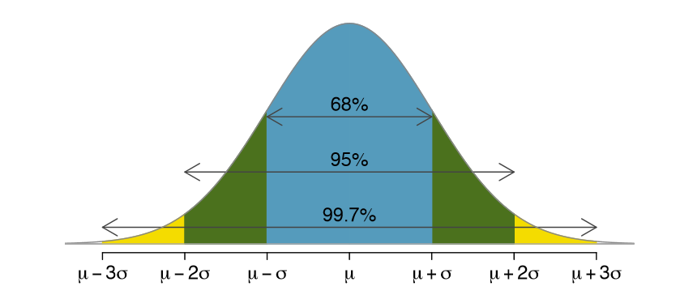

---
```{r setup, include=FALSE}
knitr::opts_chunk$set(echo = TRUE)
```

### Интро

Думаю, не стоит особо много говорить про то, как важно при работе с данными преобразовывать их к нормальному чистому виду. Это позволит моделям, которые вы потом будете применять к данным, да и в целом всей аналитике работать более точно и давать более правдивые выводы. 

#### Преобразование данных включает в себя:

1. **Работу с пропусками**
2. **Обработку выбросов**
3. **Нормализацию данных**
4. **Работу с категориальными признаками**

Ниже мы разберем каждый пункт подробно, а пока давайте увидим, насколько разными могут быть данные. 

#### Деление признаков по типу переменных:

1. **Числовые** - 1, -2, 3.42, 102.0, ...
2. **Строковые** - 'HSE', 'Moscow', 'nagibator2006@mail.ru', ...
3. **Булевские** - TRUE, FALSE
4. **Специальный формат даты** - '2021-01-20', '2017-07-22T13:10:11", ...

#### Деление признаков по смыслу:

1. **Непрерывные** - могут принимать любые значения на каком-то отрезке

_Примеры:_ рост, вес, зарплата, прибыль, ВВП, возраст

2. **Категориальные** - принимают ограниченное (как правило, небольшое) кол-во значений

_Примеры:_ города, возраст в выборке подростков, месяц

3. **Бинарные (дамми)** - частный случай категориальных, когда признаков 2  

_Примеры:_ пол, исходы монетки, пороговая з/п

Каждый признак относится к какому-то типу из первой группы и из второй!

### 1. Работа с пропусками

{width=300px}

Пропуски в данных - это очень частое явление. Например, данные могут потеряться, либо их вообще может не быть за какой-то период. Также люди не очень любят делиться информацией, отвечая на всякие вопросы.

#### Методы борьбы: 

1. **Заполнение** пропусков (средним, медианой, скользящим средним)
2. **Удаление** (иногда даже целых признаков или наблюдений)
3. **Дамми-признаки** на пропуски
4. **ML-модели**, заполняющие пропуски

### 2. Обработка выбросов

Выбросы - это нетипичные _для вашей выборки_ значения. Выбросы могут вкрайне сломать все ваши выводы, если вы пользуетесь неутойчивыми к выбросам моделям или просто средним) 

#### Откуда появляются? 

1. **Ошибки в данных:** 

Например, в опроснике про з/п кто-то случайно приписал себе лишний 0 и стал зарабатывать не 60000 рублей, а 600000

2. **Данные из другого распределения:**

Например, вы измеряете з/п людей в городе. Добрыня работает охранником в Пятерочке и получает 40000 рублей, Света работает массажисткой и получает 80000 рублей, Петя работает стажером-аналитиком и получает 70000 рублей, а Егор работает на позиции Head of Data-Science в крупной компании и получает около 1млн рублей. Для данной выборки Егор будет считаться выбросом, так как его з/п сильно отличается от других. Однако стоит понимать, что это произошло не из-за какой-то ошибки, а из-за того, что Егор пришел к нам просто из другого распределения данных (из распределения людей с более высокой з/п). Таким образом, если бы мы рассматривали выборку из людей, похожих по з/п на Егора, то Егор бы уже не являлся выбросом для нас, а вот какой-нибудь Петя бы уже стал считаться. 

#### Как обнаружить выбросы? 

1. **Построить распределение и увидеть длинный хвост**

<center>
{width=400px}
</center>

2. **Посчитать среднее и сравнить его с медианой**

```{r}
x <- sample(10000:50000, size=20)
x <- c(x, 1000000)

mean(x)
median(x)
```

3. **С помощью квантилей и box-plot** 

<center>
{width=400px}
</center>

#### Методы борьбы: 

<center>
{width=400px}
</center>

1. **Удалять все, что ниже** $Q_1 - 1.5 \cdot IQR$ **и выше** $Q_3 + 1.5 \cdot IQR$

2. **Удалять по 95-99% квантилям** - если распределение имеет длинный хвост справа

```{r}
x <- sample(10000:50000, size=20)
x <- c(x, 1000000)

# Среднее до:
mean(x)

quant <- quantile(x, 0.95)

x_after <- x[x < quant]

# Среднее после
mean(x_after)
```

3. **Правило** $2 \sigma$ **и** $3 \sigma$ - в случае если распределение куполообразное

<center>
{width=400px}
</center>

4. **И снова ML**

### 3. Нормализация данных 

Нужна, чтоб многие модели и алгоритмы над данными работали лучше. 

#### Виды: 

1. **Standard Scaler:**

$$
x_i = \frac{x_i - \bar{x}}{\hat{\sigma}}
$$

2. **Robust Scaler:**

$$
x_i = \frac{x_i - med(x)}{IQR}
$$

3. **Min-Max Scaler:** 

$$
x_i = \frac{x_i - min(x)}{max(x) - min(x)} \in [0, 1] 
$$

### 4. Работа с категориальными признаками

#### 1. Label encoding

Представим, что в нашей моделе есть признак, который принимает несколько факторных значений. Например, в выборке по студентам есть переменная, отвечающая за то, какой университет закончил студент, и она принимает только 3 значения: РАНХиГС, ВШЭ, МГУ. Так как наша модель понимает только числа, надо эти признаки закодировать. Давайте закодируем их в 1, 2, 3. 

<center>{width=60%}</center>

Но тут есть проблема. В таком случае на данных установится некий **порядок**. Модель будет понимать, будто бы раз 2 < 3, значит и категория под номером 2 "меньше" категории под номером 3, то есть ВШЭ хуже МГУ... 

<center>{width=50%}</center>

Чтобы такого избежать, нужно пользоваться **One Hot Encoding**.

#### 2. One Hot Encoding

One Hot Encoding - это преобразование значений категориального признака в отдельные бинарные признаки. То есть раз у нас был признак "Университет", принимающий значения РАНХиГС, ВШЭ, МГУ, то теперь у нас есть 3 признака РАНХиГС, ВШЭ, МГУ, которые для каждого наблюдения принимают значения 1, если студент закончил данный университет и значения 0, если нет. 

<center>{width=70%}</center>


