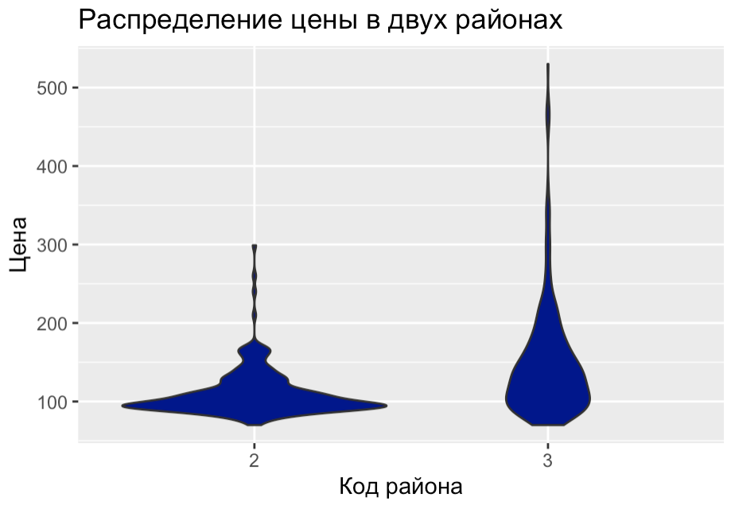

<style>
h1,
h2,
h3,
h4,
h5,
h6  {
  color: #317eac;
}
</style>
```{r setup, include=FALSE}
knitr::opts_chunk$set(echo = TRUE, warning=FALSE, message=FALSE)
```

<center>
{width=700px}
</center>

### Правила игры

1. Вы должны оформить КР в R Markdown или обычном R скрипте.
2. Вы можете не комментировать ваш код. Просто пишите код для решения задач.
3. Отправить КР нужно до 10:50 на почту своего семинариста `ahmedzarmanbetov@mail.ru` или `midiukin@mail.ru`.
4. Если вам что-то непонятно, то задавайте вопросы.

### Задание №0 

```{r eval=FALSE}
# packages <- c('readr', 'dplyr', 'tidyr', 'ggplot2', 'DescTools')
# install.packages(packages)
library(readr)
library(dplyr)
library(tidyr)
library(ggplot2)
library(DescTools)
```

Подгрузите ваш датасет.

```{r eval=FALSE}
url <- 'https://raw.githubusercontent.com/MidiukinM/R_sociology/main/exercises/exam/data/data.csv'
df <- read_csv(url)
```

Это датасет, в котором находится информация о стоимости квартир в Москве.

* `price` – цена квартиры в $1000
* `totsp` – общая площадь квартиры, кв.м.
* `livesp` – жилая площадь квартиры, кв.м.
* `kitsp` – площадь кухни, кв.м.
* `dist` – расстояние от центра в км.
* `metrdist` – расстояние до метро в минутах
* `walk` – 1 – пешком от метро, 0 – на транспорте
* `brick` – 1 – кирпичный, монолит ж/б, 0 – другой
* `floor` – 1 – этаж кроме первого и последнего, 0 – иначе.
* `code` – число от 1 до 8, определяющее район Москвы:
1. Cевер, вокруг Калужско-Рижской линии метрополитена
2. Север, вокруг Серпуховско-Тимирязевской линии метрополитена
3. Северо-запад, вокруг Замоскворецкой линии метрополитена
4. Северо-запад, вокруг Таганско-Краснопресненской линии метрополитена
5. Юго-восток, вокруг Люблинской линии метрополитена
6. Юго-восток, вокруг Таганско-Краснопресненской линии метрополитена
7. Восток, вокруг Калиниской линии метрополитена
8. Восток, вокруг Арбатско-Покровской линии метрополитена

В датасете нет пропущенных значений Не нужно беспокоиться об этом.

### Задание №1 (30 баллов)

Построить 95% и 99% асимптотические доверительные интервалы для средней стоимости квартир в Москве. Доверительные интервалы строить вручную, без встроенной функции для нахождения доверительного интервала.

```{r eval=FALSE}
alpha <- 0.05  # уровень значимости
```

### Задание №2 (30 баллов)

Постройте на одном графике (разными цветами) гистограмму распределения цены для района с кодом 2 (`code = 2`) и района с кодом 3 (`code = 3`). Какие выводы вы можете сделать по этим графикам?

**Hints:**

1. Используйте функцию `geom_violin`.
2. Не забывайте про `factor()` для категориальной переменной.
3. Должен получиться график ниже.

<center>
{width=700px}
</center>

### Задание №3 (40 баллов)

Проверить гипотезу, что ровно половина квартир в Москве находится в 10 минутах от метро **пешком**. 

$$
\begin{aligned}
&H_0: \hspace{2mm} p = 0.5 \hspace{2mm} \text{Половина квартир в 10 минутах от метро пешком} \\
&H_A: \hspace{2mm} p < 0.5  \hspace{2mm} \text{Меньше половины квартир в 10 минутах от метро пешком}
\end{aligned}
$$

**Hints:**
1. Можете построить вручную, либо воспользоватсья встроенной функцией `ZTest` из пакета `DescTools`. Аргумент `sd_pop` в этой функции это стандартное отклонение выборки.
2. Для решения этого задания вам нужно создать новую колонку.

