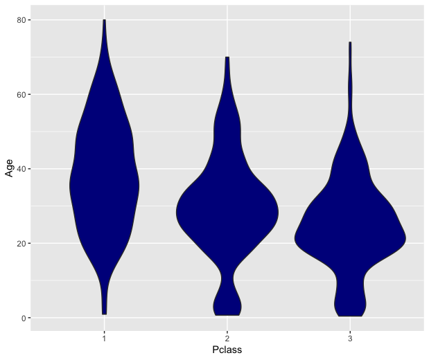

<style>
h1,
h2,
h3,
h4,
h5,
h6  {
  color: #317eac;
}
</style>
```{r setup, include=FALSE}
knitr::opts_chunk$set(echo = TRUE, warning=FALSE, message=FALSE)
```

### Правила игры

1. Вы должны оформить КР в R Markdown или обычном R скрипте.
2. Вы можете не комментировать ваш код. Просто пишите код для решения задач.
3. Если вам что-то непонятно, то задавайте вопросы.

### Задание №0

```{r}
# packages <- c('readr', 'dplyr', 'tidyr', 'ggplot2', 'DescTools')
# install.packages(packages)
library(readr)
library(dplyr)
library(tidyr)
library(ggplot2)
library(DescTools)
```

Подгрузите ваш датасет.

```{r eval=FALSE}
url <- 'https://raw.githubusercontent.com/Yorko/mlcourse.ai/master/data/titanic_train.csv'
df <- read_csv(url)
```

Перед вами датасет по пассажирам "Титаника". Он содержит в себе:

* `PassengerId` - id пассажира
* `Survived` - выжил пассажир или нет (1 - выжил, 0 - нет)
* `Pclass` - класс обслуживания (1 — высший, 2 — средний, 3 — низший)
* `Name` - имя
* `Sex` - пол
* `Age` - возраст
* `SibSp` - сколько братьев/сестер у пассажира было на борту
* `Parch` - количество родителей, детей (в том числе приемных) на борту
* `Ticket` - номер билета
* `Fare` - сколько заплатил за билет
* `Cabin` - номер кабины
* `Embarked` - порт посадки (C — Шербур; Q — Квинстаун; S — Саутгемптон)

### Задание №1

Найдите среднюю, медианую цену билета (`Fare`), а также количество человек для каждого порта посадки (`Embarked`). Выведите результат в виде датафрейма.

<center>
{width=300px}
</center>

### Задание №2

Нарисуйте следующий график.

<center>
{width=500px}
</center>

### Задание №3

Проверить гипотезу, что вероятность выжить человека 30 лет или старше равна 0.4.

$$
\begin{aligned}
&H_0: \hspace{2mm} p = 0.4 \hspace{2mm}  \\
&H_A: \hspace{2mm} p \neq 0.4  \hspace{2mm}
\end{aligned}
$$
