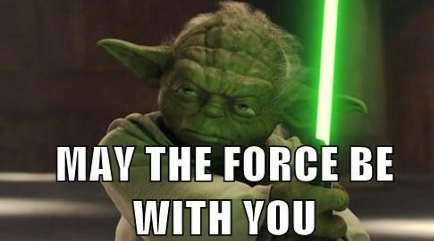
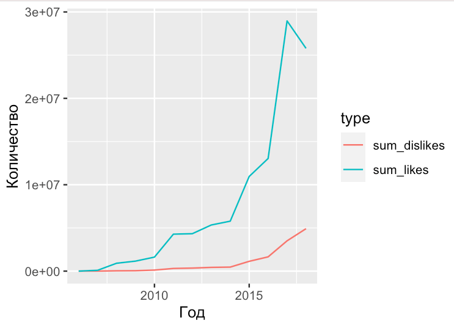

<style>
h1,
h2,
h3,
h4,
h5,
h6  {
  color: #317eac;
}
</style>
```{r setup, include=FALSE}
knitr::opts_chunk$set(echo = TRUE, warning=FALSE, message=FALSE)
```

<center>
{width=700px}
</center>

### Правила игры

1. Вы должны оформить КР в R Markdown или обычном R скрипте.
2. Вы можете не комментировать ваш код. Просто пишите код для решения задач.
3. Отправить КР нужно до 19:35 на почту `ahmedzarmanbetov@mail.ru`.
4. Если вам что-то непонятно, то задавайте вопросы.

### Задание №0 

```{r eval=FALSE}
# packages <- c('readr', 'dplyr', 'tidyr', 'ggplot2')
# install.packages(packages)
library(readr)
library(dplyr)
library(tidyr)
library(ggplot2)
```

Подгрузите ваш датасет.

```{r eval=FALSE}
url <- 'https://raw.githubusercontent.com/MidiukinM/R_sociology/main/exercises/test/data/data1.rds'
df <- read_rds(url)
```

Это датасет, в котором находится информация о некоторой выборке музыкальных 
клипов на youtube. В нём представлены следующие переменные:

* `title` -- название клипа
* `commentCount` -- количество комментариев
* `dislikeCount` -- количество дизлайков
* `likeCount` -- количество лайков
* `music_style` -- жанр музыки в клипе (попса, рэп и т.д.)
* `performer` -- название канала, который выпустил клип
* `viewCount` -- количество просмотров
* `date` -- дата выпуска клипа
* `year`, `month`, `day` -- отдельные колонки для компонент колонки `date`

В датасете нет пропущенных значений Не нужно беспокоиться об этом.

### Задание №1 (50 баллов)

**Цель:**
Нужно найти для каждого музыкального жанра топ-3 перфомера по конверсии 
просмотра в клик.

- конверсия просмотра в клик это  `conv = likeCount / viewCount`, то есть 
сколько просмотров у клипа на 1 лайк
- мы рассматриваем перфомеров в рамках всех их клипов, то есть конверсия 
должна быть посчитана для всех клипов вместе, а не для отдельно взятого клипа
- при этом будем рассматривать перформеров, у которых есть хотя бы 10 клипов
  
### Задание №2 (50 баллов)

Постройте на одном графике динамику суммарных лайков и дизлайков по годам. 
Исключите 2019 год, так за этот год мало данных.
У вас должен получиться примерно такой график

<center>
{width=700px}
</center>
