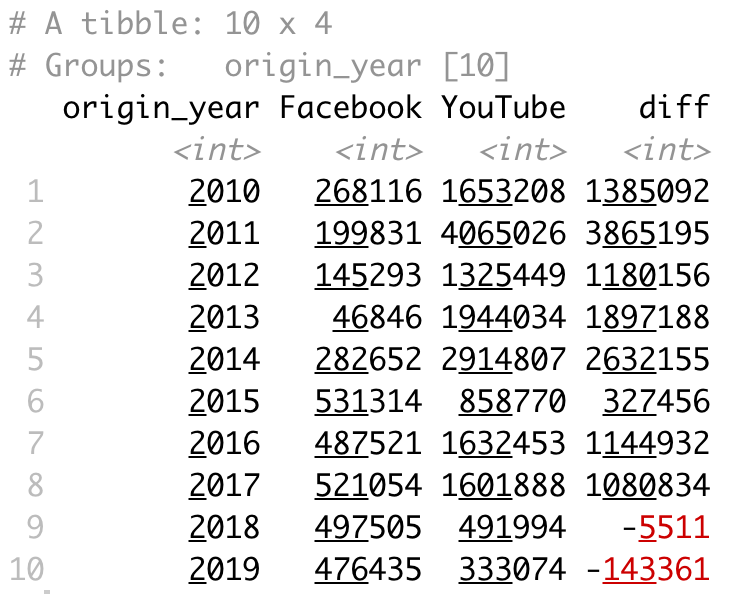
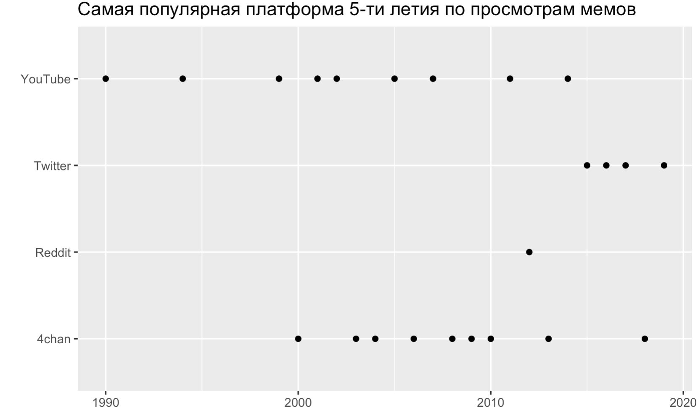

<style>
h1,
h2,
h3,
h4,
h5,
h6  {
  color: #317eac;
}
</style>
```{r setup, include=FALSE}
knitr::opts_chunk$set(echo = TRUE, warning=FALSE, message=FALSE)
```

<center>
{width=400px}

</center>

### Правила игры

1. Вы должны оформить КР в обычном R скрипте.
2. Вы можете не комментировать ваш код. Просто пишите код для решения задач.
3. Отправить КР нужно до 13:40 на почту `midiukin@mail.ru`.
4. Если вам что-то непонятно, то задавайте вопросы.

### Задание №0 

```{r eval=FALSE}
# packages <- c('readr', 'dplyr', 'tidyr', 'ggplot2')
# install.packages(packages)
library(readr)
library(dplyr)
library(tidyr)
library(ggplot2)
```

Подгрузите ваш датасет.

```{r eval=FALSE}
url <- 'https://raw.githubusercontent.com/MidiukinM/R_sociology/main/exercises/test2/data/data2.rds'
df <- read_rds(url)
```

Это датасет, в котором находится информация о некоторой выборке мемов с сайта https://memes.com/. В нём представлены следующие переменные:

* `name` -- название мема
* `status` -- текущий статус мема
* `type` -- тип мема
* `origin_year` -- год появления мема
* `origin_place` -- площадка, на которой мем впервые появился
* `views` -- кол-во просмотров у мема
* `videos` -- кол-во видео с этим мемом
* `photos` -- кол-во фоток с этим мемом
* `comments` -- кол-во комментариев

### Задание №1 (50 баллов)

**Задача:**

Сравнить суммарные просмотры мемов на двух площадках (Facebook и YouTube) во времени после 2010 года. 

**Подсказки:**

1. Если вы все сделали правильно, должна получиться таблица как на картинке ниже:

<center>
{width=300px}

</center>

### Задание №2 (50 баллов)

**Задача:**

Построить точечный график, на котором по оси x отложен год создания мема, а по оси y - самая популярная площадка с мемами в этом году (популярная по кол-ву просмотров). Для этого дополнительно нужно отобрать года после 1900 и исключить такие площадки, как "another" и "Unknown" 

**Подсказки:**

1. Для того, чтобы отобрать самую популярную платформу, можно воспользоваться функцией `top_n(1, _здесь колонка, по которой отбираем_)`. 
2. Если вы все сделали верно, должен получиться график как на картинке ниже: 

<center>
{width=500px}
</center>


